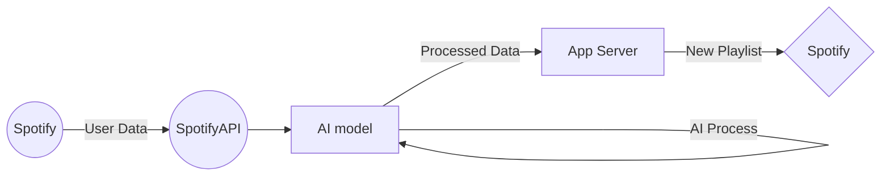

# Welcome to Moodify! 
Feeling under the weather today? Is your day too good to be true? Did you get a message from that special person today? with **Moodify** you can generate a playlist that matches your energy.
You pick your desired topics and we'll take care of the rest.

**Moodify** is a free **AI powered** playlist generator service.
Our text classification model selects the songs according to the desired labels selected by the user. 
# How does it work?
Moodify links to the user's Spotify account and fetches the information from the users profile using SpotifyAPI and GeniusAPI to pull the lyrics of the song. Then a server hosting the AI model receives the data and feeds the model with the data. After processing the data, the model will output a table that contains a matching percentage relating the lyrics and the specified label. Then the other server takes that data and builds a playlist with the users favorite songs that best fit the criteria. Finally, the new playlist is pushed into the user's Spotify account.
 > Our program uses MLflow to deploy Generative AI applications, making it easier to manage the entire process of developing and running GenAI models. With MLflow, we keep track of model experiments, versions, and performance, making sure our applications are consistent and reliable across different environments. This setup helps us quickly refine models and launch AI solutions that are efficient, scalable, and ready for real-world use.

